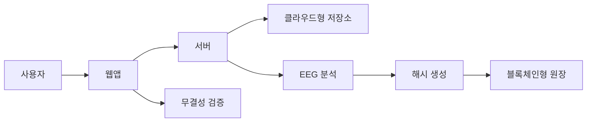

## 1. 프로젝트 소개

EEG 데이터를 클라우드에 저장하고, 데이터의 해시값을 블록체인형 원장에 기록해서 EEG 데이터가 나중에 변조되었는지 검증하는 시스템

EEG 원본 데이터를 블록체인에 직접 올리지 않는 것. 

원본 데이터는 클라우드 저장소에 보관하고, 블록체인에는 해시값만 기록

## 2. 개발 배경

EEG 데이터는 BCI, 뉴로테크, 의료 연구, 집중도 분석 같은 분야에 활용됨.

하지만 EEG 데이터는 연구나 분석 결과의 신뢰성이 중요함. 나중에 데이터가 수정되었는지, 분석 결과가 원본 데이터와 같은지 확인할 수 있어야 함.

이 문제를 해결하기 위해 클라우드와 블록체인을 함께 사용했음.

- 클라우드: EEG 원본 저장과 분석 처리
- 블록체인: 데이터 해시와 기록의 무결성 검증
- 웹앱: 업로드, 분석 결과 확인, 검증 기능 제공

## 3. 시스템 구조

## 4. 주요 기능

### EEG 파일 업로드

사용자는 EEG 파일을 업로드할 수 있음

프로토타입에는 `theta`, `alpha`, `beta`, `Fp1`, `Fp2` 값이 들어 있는 샘플 EEG 파일을 포함

### EEG 특징 분석

파일을 읽어서 각 EEG 채널의 기본 통계를 계산.

계산하는 값은 간단하게 `beta / alpha` 비율로 계산함.

### 해시 기록

서버는 EEG 원본 파일의 SHA-256 해시와 분석 결과의 SHA-256 해시를 생성함.

그리고 이 해시값들을 블록체인형 원장에 기록함.

원장에는 이전 블록의 해시도 함께 저장되기 때문에, 중간 기록이 바뀌면 원장 검증이 실패함.

### 무결성 검증

사용자가 같은 EEG 파일을 다시 업로드하면, 현재 파일의 해시와 원장에 저장된 해시를 비교.

같은 파일이면 검증 성공이 표시되고, 파일 내용이 조금이라도 바뀌면 검증 실패가 표시됨.

## 5. 구현 기술
- S3 연동
- Ethereum Sepolia 테스트넷 배포
- MetaMask 지갑 연동
- 실제 EEG EDF 파일 지원
- MNE 기반 EEG 전처리와 주파수 분석
- 접근 권한 관리 기능

## 6. 기대 효과

이 시스템은 EEG 데이터의 원본성과 분석 결과의 신뢰성을 검증하는 데 사용.

특히 BCI 연구, 뉴로테크 서비스, 의료 데이터 관리처럼 데이터 신뢰성이 중요한 분야에서 활용.

블록체인은 데이터를 저장하는 공간이 아니라, 데이터가 변조되지 않았음을 증명하는 신뢰 계층으로 사용.
